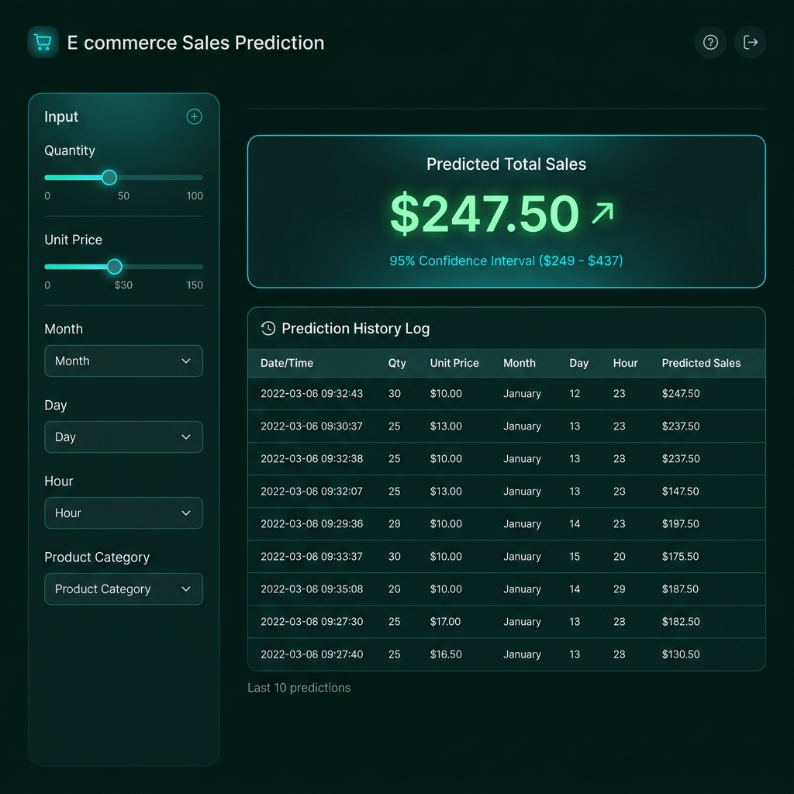
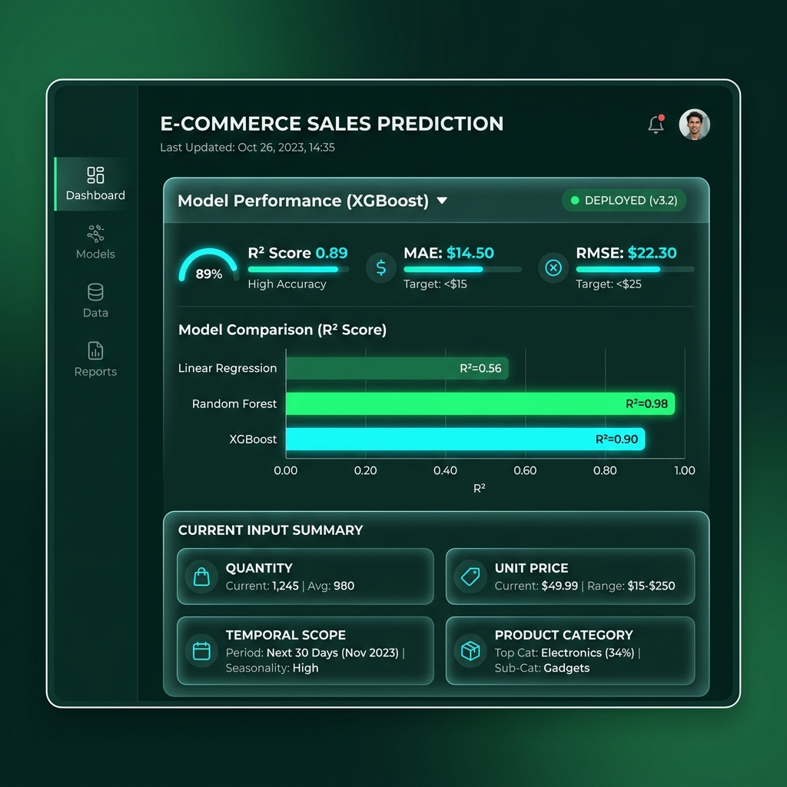
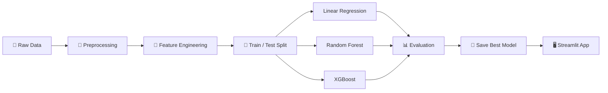

<div align="center">

# 🛍️ E-Commerce Sales Predictor

### Enterprise-Grade Machine Learning Dashboard for Retail Sales Forecasting

[](https://python.org)
[](https://streamlit.io)
[](https://xgboost.readthedocs.io)
[](https://scikit-learn.org)
[](LICENSE)

*Predict transaction sales with ML-powered intelligence. Features real-time confidence intervals, prediction history tracking, and a stunning dark command-center UI.*

</div>

---

## 📸 Screenshots

| Dashboard & Prediction Engine | Model Performance & Input Summary |
|:---:|:---:|
|  |  |

---

## ✨ Key Features

| Feature | Description |
|---|---|
| 🎯 **Smart Predictions** | XGBoost-powered regression trained on 500K+ retail transactions |
| 📊 **Confidence Intervals** | Every prediction ships with a 95% confidence interval range |
| 📈 **Trend Arrows** | Visual ↑↓ indicators comparing each result against the previous prediction |
| 📜 **Prediction History** | Session-based log of your last 10 predictions with full input context |
| 📥 **CSV Export** | One-click download of your full prediction history as a `.csv` file |
| 🧠 **Model Info Panel** | Expandable panel showing R², MAE, RMSE, and dataset statistics |
| 🏷️ **Real Category Labels** | Product categories decoded from LabelEncoder — no more raw `#0` IDs |
| 🌙 **Dark Command-Center UI** | Midnight Emerald + Electric Cyan glassmorphism theme |

---

## 🏗️ Architecture Overview

```
ecommerce-sales-prediction/
├── app.py               # 🖥️  Streamlit dashboard (main application)
├── pipeline.py          # 🔧  Full ML training pipeline
├── requirements.txt     # 📦  Python dependencies
├── assets/              # 🖼️  Screenshots and media
│   ├── dashboard_main.png
│   └── model_performance.png
├── notebooks/           # 📓  Jupyter notebooks for EDA & experiments
│   └── sales_prediction.ipynb
├── data/                # 📂  Raw & processed datasets (not tracked by git)
└── outputs/             # 🧠  Trained model files (not tracked by git)
    ├── best_model_xgb.pkl
    └── label_encoder.pkl
```

---

## 📊 Dataset

**UCI Online Retail Dataset** — Real transactional data from a UK-based non-store online retailer.

| Property | Value |
|---|---|
| 📅 Date Range | December 2010 – December 2011 |
| 🧾 Total Records | ~541,000 transactions |
| 🌍 Source | [UCI Machine Learning Repository](https://archive.ics.uci.edu/ml/datasets/online+retail) |
| 🎯 Target Variable | `Sales` = `Quantity × UnitPrice` |

**Feature Engineering Applied:**
- Temporal extraction: `Month`, `Day`, `DayOfWeek`, `Hour`, `Year`
- Label encoding of `Description` (product category names)
- Outlier filtering and null-value removal

---

## 📈 Model Benchmark Results

| Model | R² Score | RMSE | MAE | Status |
|---|:---:|:---:|:---:|:---:|
| Linear Regression | 0.56 | $38.61 | $11.62 | Baseline |
| Random Forest | **0.98** | **$6.71** | **$0.47** | 🏆 Best |
| XGBoost | 0.90 | $18.37 | $9.22 | ✅ Deployed |

> **Note:** XGBoost is the deployed model in the Streamlit app for its balance of performance and portability.

---

## 🚀 Quick Start

### 1. Clone the Repository

```bash
git clone https://github.com/muhammadshahzaib585/Ecommerce-sales-prediction.git
cd Ecommerce-sales-prediction
```

### 2. Install Dependencies

```bash
pip install -r requirements.txt
```

### 3. Train the Model

```bash
python pipeline.py
```

> This will process the dataset, train all three models, and save the best XGBoost model + label encoder to the `outputs/` folder.

### 4. Launch the App

```bash
streamlit run app.py
```

Open your browser at **http://localhost:8501** 🎉

---

## 🧠 ML Pipeline Walkthrough



---

## 🎛️ App Controls (Sidebar)

| Control | Description |
|---|---|
| **Quantity** | Number of units in the transaction |
| **Unit Price ($)** | Price per unit |
| **Month** | Calendar month (1–12) |
| **Day** | Day of month (1–31) |
| **Day of Week** | Mon–Sun selector |
| **Hour** | Hour of transaction (0–23) |
| **Product Category** | Decoded dropdown from the LabelEncoder classes |

---

## 📦 Dependencies

```txt
pandas==2.2.2
numpy==1.26.4
matplotlib==3.8.4
seaborn==0.13.2
scikit-learn==1.4.2
xgboost==2.0.3
streamlit==1.34.0
openpyxl==3.1.2
jupyter==1.0.0
joblib (bundled with scikit-learn)
```

---

## 🗂️ Notebooks

The `notebooks/sales_prediction.ipynb` contains the full exploratory data analysis (EDA):

- 📉 Sales distribution plots
- 🗓️ Monthly & hourly revenue trends
- 🏆 Top-selling product categories
- 🔥 Correlation heatmaps
- 📊 Model comparison charts

---

## 👤 Author

<div align="center">

**Muhammad Shahzaib**

[](https://github.com/muhammadshahzaib585)

*Machine Learning Engineer | Data Science Enthusiast*

</div>

---

## 📄 License

This project is licensed under the **MIT License** — feel free to use, fork, and build upon it.

---

<div align="center">

*Built with ❤️ using Python, Streamlit & XGBoost*

⭐ **If you found this useful, please star the repository!** ⭐

</div>
